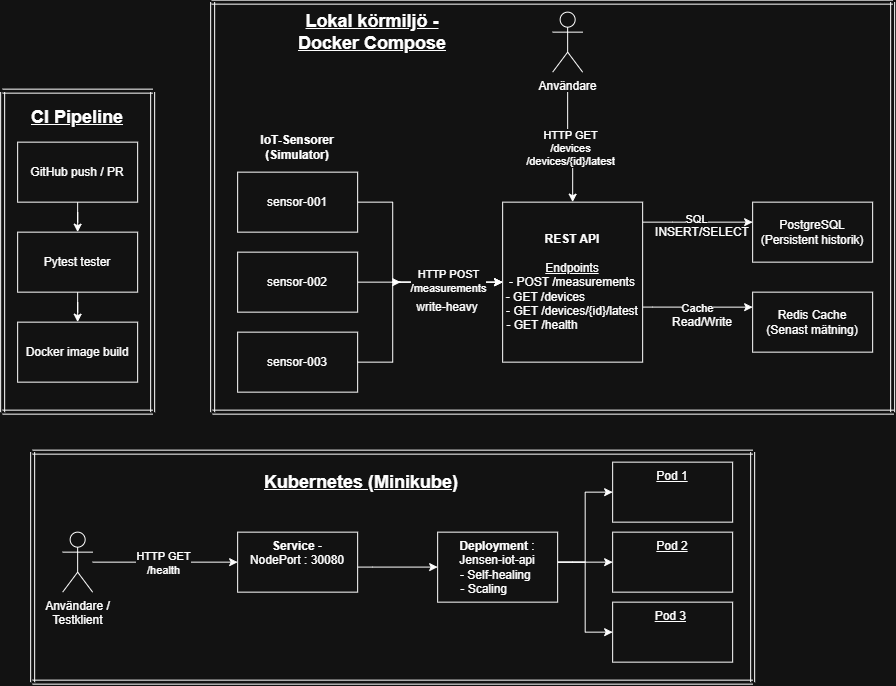

# Arkitekturbeskrivning & Systemöversikt

Detta dokument beskriver arkitekturen för **Jensen IoT Platform**, inklusive komponenter, dataflöden, lokal körmiljö med Docker Compose, CI-pipeline samt Kubernetes.

## Arkitekturdiagram

## Arkitekturval

De tre simulerade IoT-sensorerna skickar mätdata till REST API:t via `POST /measurements`. Detta är systemets write-heavy-flöde.

REST API:t validerar inkommande data och lagrar mätningarna i PostgreSQL. PostgreSQL används för beständig historik och behåller därför mätdata även när containrarna startas om.

Redis används som cache för den senaste mätningen per sensor. API:t kan läsa och skriva den senaste mätningen i Redis, medan PostgreSQL fungerar som den beständiga datakällan.

Den lokala miljön körs med Docker Compose och består av simulator, REST API, PostgreSQL och Redis.

CI-pipelinen i GitHub Actions kör pytest-tester och bygger API:ts Docker-image vid push eller pull request.

Kubernetes-demon körs i Minikube. En NodePort-Service på port `30080` leder trafik till en Deployment med tre Pod-repliker. Deploymenten har även testats för self-healing och scaling.